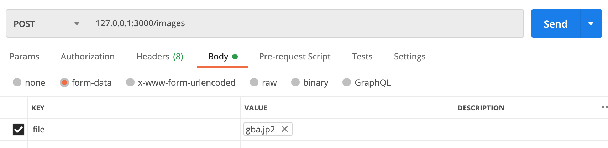
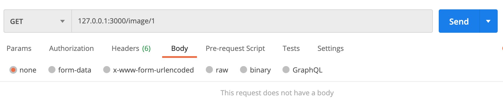

# Shopify 2021 Backend Challenge: Image Repo
The [instructions](https://docs.google.com/document/d/1ZKRywXQLZWOqVOHC4JkF3LqdpO3Llpfk_CkZPR8bjak/edit)

## Contents
This github repository contains the rails app that serves as a simple image repository.

## Setup
1.  Clone this repository
2.  Connect the app to a mysql server (see config/database.yml)
3.  Run ``rails db:migrate`` 
4.  Run ``rails s`` to start the server

## Usage
The application accepts images as formdata to /images

An image can be retrieved with the conventional /image/{id}

